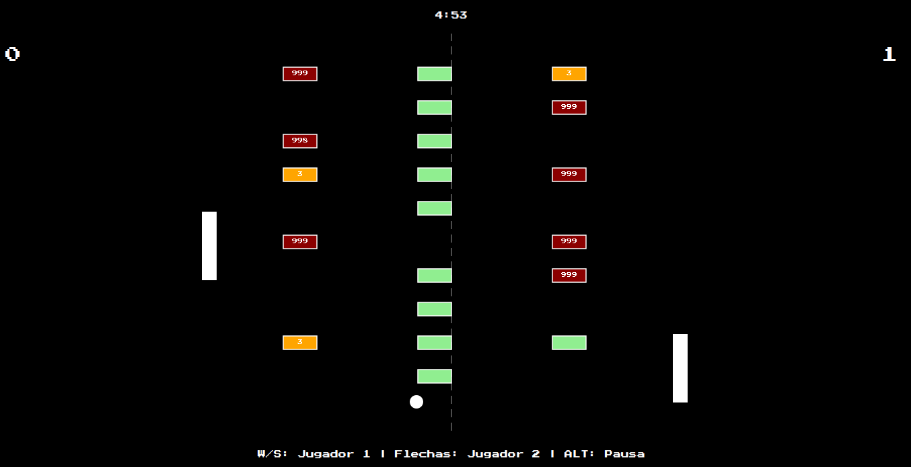
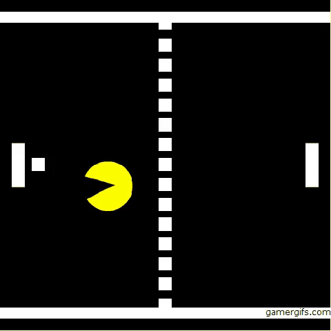

# Pong Evolved

A modern reimplementation of the classic Pong game built with JavaFX, demonstrating **23 instances of design patterns** across 14 pattern types. This project showcases professional software architecture principles including SOLID, MVC, and functional programming with Vavr.


---

## Features

- **Multiple Game Modes**
  - 1 Player vs AI with 10 difficulty levels
  - 2 Player local multiplayer
  - Level Editor with persistent custom levels

- **AI Opponents**
  - Ten difficulty levels with progressively challenging behavioral patterns
  - Advanced AI using trajectory prediction and reaction timers
  - Configurable error generation for realistic gameplay

- **Power-up System**
  - Speed boost items
  - Fog effect obstacles
  - Paddle resizing power-ups

- **Level Editor**
  - Visual block placement editor
  - Save/Load custom levels to SQLite database
  - Undo/Redo functionality using Memento pattern

- **Retro Aesthetic**
  - Classic pixel art style with Press Start 2P font
  - Sound effects and background music
  - Particle effects for collisions

---

## Screenshots

<table>
  <tr>
    <td></td>
    <td></td>
    <td></td>
  </tr>
  <tr>
    <td align="center"><b>1 Player vs AI</b></td>
    <td align="center"><b>2 Player Mode</b></td>
    <td align="center"><b>Level Editor</b></td>
  </tr>
</table>

---

## Design Patterns Implemented

This project demonstrates **23 instances across 14 design pattern types**:

### Architectural Patterns
- **MVC (Model-View-Controller)** - Main application architecture separating concerns
- **Observer** - Game event system for audio, UI updates, and state changes
- **Facade** - Simplified interface for complex subsystems

### Creational Patterns
- **Singleton** - Global configuration and prototype registry management
- **Builder** - Complex level construction with fluent API
- **Factory Method** - AI service and power-up item creation
- **Prototype** - Paddle cloning and configuration management

### Structural Patterns
- **Composite** - Hierarchical game object management
- **Adapter** - Unified input interface for keyboard controls
- **Decorator** - Enhanced paddle behaviors and visual effects

### Behavioral Patterns
- **Strategy** - Multiple implementations:
  - Movement strategies (Player, AI Easy/Medium/Hard)
  - Collision strategies (Ball-Paddle, Ball-Block, Ball-Wall)
- **Memento** - Undo/Redo functionality in level editor
- **State** - Game state transitions (Menu, Playing, Paused, GameOver)
- **Template Method** - Base controller class with customizable lifecycle

---

## Tech Stack

- **Java 17** - Core programming language
- **JavaFX 17.0.12** - GUI framework
- **Maven** - Build and dependency management
- **Vavr 0.10.4** - Functional programming library
- **SQLite 3.47.2.0** - Embedded database for level persistence
- **HikariCP 5.1.0** - High-performance JDBC connection pool
- **Ikonli 12.3.1** - FontAwesome 5 icon library
- **Logback 1.2.13** - Logging framework

---

## Prerequisites

- **JDK 17 or higher** - [Download from Oracle](https://www.oracle.com/java/technologies/downloads/) or [OpenJDK](https://openjdk.org/)
- **Maven 3.6+** - [Download Maven](https://maven.apache.org/download.cgi)

---

## Installation & Running

### Option 1: Maven (Recommended)

```bash
# Clone the repository
git clone https://github.com/YOUR_USERNAME/pong-evolved.git
cd pong-evolved

# Compile the project
mvn clean compile

# Run the application
mvn javafx:run
```

### Option 2: Docker

```bash
# Build the Docker image
docker build -t pong-evolved .

# Run the container with VNC access
docker run -d -p 5901:5901 -p 6901:6901 pong-evolved

# Access the application
# VNC: localhost:5901 (password: vncpassword)
# Browser: http://localhost:6901/?password=vncpassword
```

### Option 3: Package as JAR

```bash
# Package the application
mvn package

# Run the JAR
java -jar target/pong-evolved-1.0-SNAPSHOT.jar
```

---

## Controls

### Player 1 (Left Paddle)
- **W** / **↑** - Move up
- **S** / **↓** - Move down

### Player 2 (Right Paddle)
- **↑** - Move up
- **↓** - Move down

### Global Controls
- **P** / **ESC** - Pause game
- **F11** - Toggle fullscreen
- **M** - Mute/Unmute audio

---

## Architecture

### MVC Structure

```
src/main/java/
├── mvc/
│   ├── modelo/          # Model - Game logic & entities
│   ├── vista/           # View - JavaFX UI components
│   └── controlador/     # Controller - User input handlers
├── patrones/            # Design pattern implementations
├── persistencia/        # Database layer (SQLite)
└── util/                # Utilities (resource loading, rendering)
```

### Key Components

- **ModeloJuego** - Central game state and logic
- **GestorEscenas** - Scene transition management
- **ServicioPersistencia** - Database operations
- **GestorColisiones** - Collision detection system
- **GestorAudio** - Sound and music management

---

## UML Diagrams

Comprehensive UML diagrams are included in the repository:

- **[Class Diagram](DiagramaClasesPongEnd.png)** - Complete system architecture
- **[Use Case Diagram](DiagramaCasosPong.drawio.png)** - User interactions
- **[Sequence Diagram](DiagramaSecuenciaPong.png)** - Game flow sequences

---

## Database

The application uses **SQLite** for level persistence. The database file is automatically created at `data/pong.db` on first run.

**Schema:**
- `niveles` - Custom level definitions
- `bloques` - Block configurations per level

---

## Project Structure

```
Proyecto02_Equipo-Polimorfo/
├── src/
│   ├── main/
│   │   ├── java/
│   │   │   ├── app/              # Application entry point
│   │   │   ├── mvc/              # MVC components
│   │   │   ├── patrones/         # Design patterns
│   │   │   ├── persistencia/     # Database layer
│   │   │   └── util/             # Utilities
│   │   └── resources/
│   │       ├── fxml/             # UI layouts
│   │       ├── css/              # Stylesheets
│   │       ├── fuentes/          # Custom fonts
│   │       ├── imagenes/         # Images
│   │       ├── videos/           # Preview videos
│   │       └── audio/            # Sound effects
├── data/                         # SQLite database
├── pom.xml                       # Maven configuration
├── Dockerfile                    # Docker configuration
└── README.md                     # This file
```

---

## License

This project is licensed under the **GNU General Public License v3.0** - see the [LICENSE](LICENSE) file for details.

---

## Authors

**Equipo Polimorfo**

Developed as part of a university project for "Modelado y Programación" (Modeling and Programming) at Universidad Nacional Autónoma de México (UNAM).

---

## Acknowledgments

- Classic Pong game by Atari (1972)
- Press Start 2P font by CodeMan38
- JavaFX community for excellent documentation
- Vavr library for functional programming support

---

<p align="center">
  <sub>Built with passion for clean architecture and design patterns</sub>
</p>
